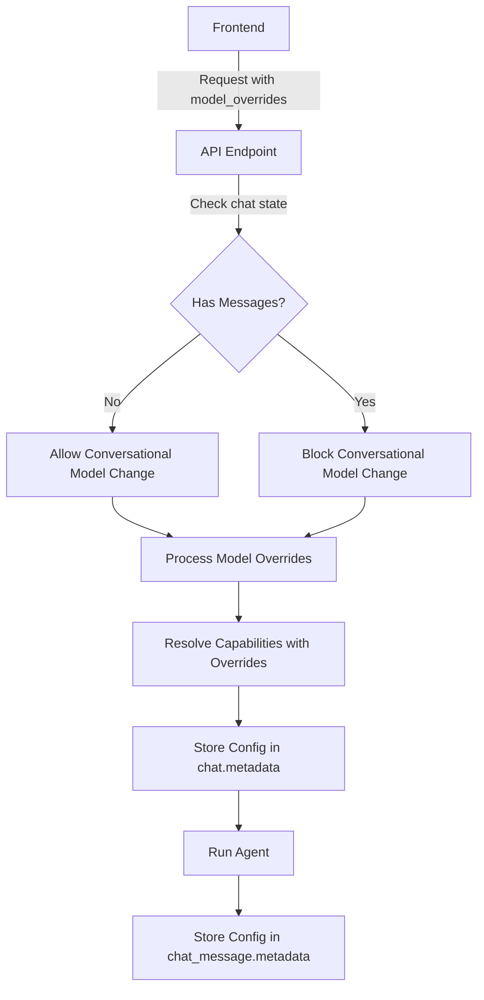

# Model Selector with Capability-Based Models

## Overview

Implement a model selector that allows frontend to specify model IDs for each capability of an agent. Conversational model can only be changed once before chat begins. Store agent configuration in chat_metadata and chat_message metadata.

## Architecture

### Data Flow



## Implementation Plan

### 1. API Request Models

**File:** `src/server.py`

- Add `model_overrides` field to request models:
  - `AgentRunRequestBaseV2` and `AgentRunRequestActualV2` 
  - Structure: `Optional[Dict[str, int]]` where key is `capability_id` and value is `model_id`
  - Special key `"conversational"` for conversational model
  - Example: `{"conversational": 123, "IMAGE_GENERATION": 456, "VIDEO_GENERATION": 789}`

### 2. Model Override Processing

**File:** `src/common/capability_utils.py`

- Modify `resolve_assistant_capabilities()` to accept `model_overrides: Optional[Dict[str, int]]`
- Apply overrides:
  - For conversational capability: use override if provided and allowed
  - For agentic capabilities: use override if provided for that capability_id
- Validate overrides against:
  - Client enabled models (`get_client_enabled_models()`)
  - Capability-based ranked models (`get_capability_based_ranked_models()`)
  - Conversational supported models (for conversational only)

### 3. Chat State Validation

**File:** `src/runtime/runners/agent_runner.py` or new utility

- Create helper function `has_chat_messages(chat_id: str, client_id: int) -> bool`
- Check if chat has any messages by querying `ChatMessage` table
- Use this to validate conversational model changes

### 4. API Endpoint Updates

**Files:** `src/runtime/runner_app.py`, `src/server.py`

- Update `agent_runner_app_v2()` to:
  - Extract `model_overrides` from request
  - Check chat state before allowing conversational model change
  - Pass `model_overrides` to capability resolution
  - Store resolved configuration in chat metadata

### 5. Chat Metadata Storage

**File:** `src/common/chat_assistant/spanner_chat_assistant.py`

- In `create_or_update_chat()` or new method:
  - Store `agent_configuration` in `chat.metadata` with structure:
    ```python
    {
      "agent_configuration": {
        "conversational_model_id": int,
        "capability_models": {
          "capability_id": model_id,
          ...
        },
        "resolved_at": timestamp,
        "assistant_id": str
      }
    }
    ```

### 6. Chat Message Metadata Storage

**File:** `src/common/chat_history/spanner_message_history.py`

- In `convert_and_store_chat_message()`:
  - Get current agent configuration from chat metadata
  - Add to message metadata:
    ```python
    metadata = {
      ...existing_metadata...,
      "agent_configuration": chat.metadata.get("agent_configuration")
    }
    ```

### 7. Frontend Support Endpoint

**File:** `src/server.py`

- Add endpoint `GET /agent/get_available_models`:
  - Input: `assistant_id` (optional), `client_id` (from JWT)
  - Returns available models per capability:
    ```python
    {
      "conversational": [model_id, ...],
      "capabilities": {
        "capability_id": [model_id, ...],
        ...
      }
    }
    ```
  - Uses `get_capability_based_ranked_models()` for each capability
  - Filters by client enabled models

### 8. Configuration Retrieval

**File:** `src/common/chat_assistant/spanner_chat_assistant.py`

- Add method `get_agent_configuration()` to retrieve stored configuration from chat metadata
- Use this when resuming chats to show current model selection

## Implementation Todos

1. **Add model_overrides field to API request models** (AgentRunRequestBaseV2, AgentRunRequestActualV2)
2. **Create helper function to check if chat has messages** (has_chat_messages)
3. **Modify resolve_assistant_capabilities()** to accept and apply model_overrides
4. **Add validation logic** to prevent conversational model changes after chat has started (depends on #2, #3)
5. **Update agent_runner_app_v2()** to extract model_overrides and pass to capability resolution (depends on #1, #3, #4)
6. **Store agent configuration in chat.metadata** after resolution (depends on #3)
7. **Store agent configuration in chat_message.metadata** when saving messages (depends on #6)
8. **Create GET /agent/get_available_models endpoint** for frontend
9. **Add method to retrieve agent configuration** from chat metadata (depends on #6)

## Key Considerations

1. **Conversational Model Restriction:**
   - Check `ChatMessage.find()` for any messages with the chat_id
   - If messages exist, reject conversational model changes
   - Allow all other capability model changes

2. **Backward Compatibility:**
   - `model_overrides` is optional - if not provided, use existing resolution logic
   - V1 APIs can continue to work as-is (they already accept model params)

3. **Validation:**
   - Validate all model IDs against client enabled models
   - Validate capability models against capability-specific ranked models
   - Raise clear errors if validation fails

4. **Metadata Structure:**
   - Store full resolved configuration, not just overrides
   - Include timestamp for debugging
   - Include assistant_id for reference

5. **Error Handling:**
   - Clear error messages for:
     - Conversational model change after chat started
     - Invalid model IDs
     - Models not available for capability
     - Client model restrictions

## Testing Considerations

- Test conversational model change before first message
- Test conversational model change rejection after messages exist
- Test agentic capability model changes at any time
- Test invalid model IDs
- Test missing capabilities
- Test chat metadata persistence
- Test chat_message metadata inclusion

## Files to Modify

1. `src/server.py` - Add model_overrides to request models, add get_available_models endpoint
2. `src/common/capability_utils.py` - Modify resolve_assistant_capabilities() to accept overrides
3. `src/runtime/runners/agent_runner.py` - Add has_chat_messages helper, validation logic
4. `src/runtime/runner_app.py` - Update agent_runner_app_v2() to handle model_overrides
5. `src/common/chat_assistant/spanner_chat_assistant.py` - Store/retrieve agent configuration in chat metadata
6. `src/common/chat_history/spanner_message_history.py` - Store agent configuration in chat_message metadata