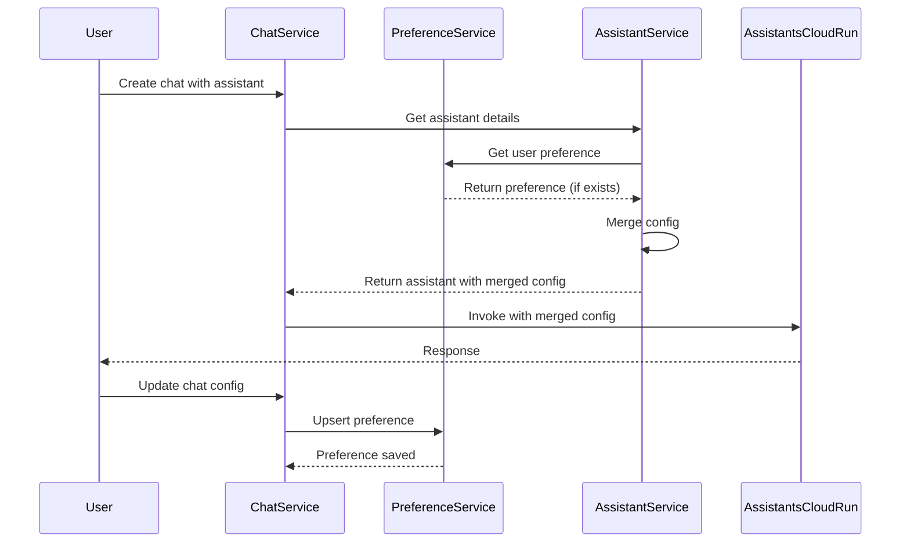

# User Agent Configuration Preferences

## Overview

Currently, `capability_config` is resolved from the assistant entity and sent to the assistants cloud-run service. This plan introduces a user preference system that allows users to override specific fields in the agent's `capability_config` (e.g., model_id in tools) when using published agents in chat. These preferences are stored per user per assistant and automatically applied when creating new chats.

## Current Architecture

- `capability_config` is stored on the `assistant` table as JSON
- When invoking an assistant, `assistant_id` is sent to the assistants service (`AI_AGENT_API_GATEWAY_URL`)
- The assistants service resolves `capability_config` from the assistant entity
- Chat has a `metadata` field that can store arbitrary data
- No existing mechanism for user-specific capability config preferences

## Implementation Plan

### 1. Database Schema

**Create migration: `create-user-assistant-preference-table.ts`**

Create a new table `user_assistant_preference` to store user preferences:

```sql
CREATE TABLE user_assistant_preference (
  client_id INT64 NOT NULL,
  user_id INT64 NOT NULL,
  assistant_id STRING(36) NOT NULL,
  preference_id STRING(36) NOT NULL DEFAULT (GENERATE_UUID()),
  capability_config_overrides JSON NOT NULL,
  created_at TIMESTAMP NOT NULL DEFAULT (CURRENT_TIMESTAMP()),
  updated_at TIMESTAMP NOT NULL DEFAULT (CURRENT_TIMESTAMP()),
  deleted_at TIMESTAMP
) PRIMARY KEY (client_id, user_id, assistant_id)
```

- Composite primary key: `(client_id, user_id, assistant_id)` ensures one preference per user per assistant
- `capability_config_overrides` stores only the fields to override (partial config)
- Index on `(client_id, user_id)` for efficient lookups

### 2. Type Definitions

**File: `src/types/user-assistant-preference.ts`**

```typescript
export interface UserAssistantPreference {
  clientId: number;
  userId: number;
  assistantId: string;
  preferenceId: string;
  capabilityConfigOverrides: Partial<AssistantCapabilityConfiguration>;
  createdAt: PreciseDate;
  updatedAt: PreciseDate;
  deletedAt?: PreciseDate | null;
}

export interface UpsertUserAssistantPreferenceReq {
  assistantId: string;
  capabilityConfigOverrides: Partial<AssistantCapabilityConfiguration>;
}
```

### 3. Service Layer

**File: `src/services/user-assistant-preference.service.ts`**

Create a service to manage user preferences:

- `getPreference(clientId, userId, assistantId)`: Retrieve user preference for an assistant
- `upsertPreference(clientId, userId, preferenceReq)`: Create or update preference
- `deletePreference(clientId, userId, assistantId)`: Soft delete preference
- `mergeWithAssistantConfig(assistantConfig, userPreference)`: Merge user preferences with assistant config

The merge logic should:

- Deep merge `capability_config_overrides` into `assistant.capabilityConfig`
- Only override specific fields (e.g., `model_id` in tools, not entire capability structure)
- Preserve assistant's base configuration for fields not overridden

### 4. Chat Service Integration

**File: `src/services/chat.service.ts`**

Modify `create()` method:

1. After fetching assistant, check for user preference:
   ```typescript
   const userPreference = await userAssistantPreferenceService.getPreference(
     clientId,
     userId,
     assistantId
   );
   ```

2. If preference exists, merge with assistant's `capabilityConfig`:
   ```typescript
   const mergedConfig = userAssistantPreferenceService.mergeWithAssistantConfig(
     assistant.capabilityConfig,
     userPreference?.capabilityConfigOverrides
   );
   ```

3. Store merged config in chat metadata (for reference) or pass to assistants service

**Modify `update()` method (PATCH `/chat/:chat_id`):**

1. When chat metadata is updated with capability config changes:

   - Extract `capability_config_overrides` from metadata
   - Auto-save to `user_assistant_preference` table
   - Use `upsertPreference()` to create or update

### 5. API Routes

**File: `src/routes/v1/user-assistant-preference.route.ts`**

Create new routes:

- `GET /user_assistant_preferences/:assistant_id`: Get user's preference for an assistant
- `PUT /user_assistant_preferences/:assistant_id`: Create or update preference
- `DELETE /user_assistant_preferences/:assistant_id`: Delete preference

**File: `src/schemas/user-assistant-preference.ts`**

Define request/response schemas for validation.

### 6. Assistants Service Integration

**File: `src/services/assistant.service.ts`**

When building assistant response in `buildAssistantResponse()`:

1. Check if user preference exists for this assistant
2. If exists, merge preference overrides with assistant's `capabilityConfig`
3. Return merged config in `AssistantResp.capabilityConfig`

This ensures the frontend receives the merged config when fetching assistant details.

### 7. External Assistants Service Integration

**File: `src/external-services/external.assistant.service.ts`**

When invoking assistant (before calling assistants service):

1. Fetch user preference for the assistant
2. Merge with assistant's `capabilityConfig`
3. Pass merged config to assistants service (if the service accepts it) OR
4. Store merged config in chat metadata and let assistants service read from there

**Note**: Need to verify if assistants service accepts `capability_config` in the payload or reads it from assistant entity. If it reads from entity, we may need to:

- Store merged config in chat metadata
- Modify assistants service to check chat metadata first, then fall back to assistant entity

### 8. Repository

**File: `src/registries/user-assistant-preference.registry.ts`**

Create repository following existing patterns in `src/registries/` for database operations.

## Data Flow



## Key Files to Modify

1. **New Files:**

   - `src/db/migrations/[timestamp]-create-user-assistant-preference-table.ts`
   - `src/types/user-assistant-preference.ts`
   - `src/services/user-assistant-preference.service.ts`
   - `src/routes/v1/user-assistant-preference.route.ts`
   - `src/schemas/user-assistant-preference.ts`
   - `src/registries/user-assistant-preference.registry.ts`

2. **Modified Files:**

   - `src/services/chat.service.ts` - Add preference lookup and merge logic
   - `src/services/assistant.service.ts` - Merge preferences in `buildAssistantResponse()`
   - `src/external-services/external.assistant.service.ts` - Apply merged config when invoking

## Implementation Todos

1. **create-db-migration**: Create database migration for user_assistant_preference table
2. **create-types**: Define TypeScript types and interfaces for user assistant preferences
3. **create-repository**: Create repository for user_assistant_preference database operations (depends on: create-db-migration)
4. **create-service**: Create UserAssistantPreferenceService with get, upsert, delete, and merge methods (depends on: create-types, create-repository)
5. **create-api-routes**: Create API routes for managing user assistant preferences (GET, PUT, DELETE) (depends on: create-service)
6. **integrate-chat-service**: Modify ChatService to fetch and apply user preferences when creating/updating chats (depends on: create-service)
7. **integrate-assistant-service**: Modify AssistantService to merge preferences in buildAssistantResponse() (depends on: create-service)
8. **integrate-external-service**: Modify ExternalAssistantService to use merged config when invoking assistants (depends on: create-service)
9. **add-validation**: Add validation to ensure preferences only override valid capability_config fields (depends on: create-service)

## Considerations

1. **Backward Compatibility**: Existing chats without preferences should continue to work with assistant's default config
2. **Validation**: Ensure user preferences only override valid fields (e.g., model_id, not entire capability structure)
3. **Performance**: Cache user preferences to avoid database lookups on every chat creation
4. **Assistants Service**: Verify how assistants service reads `capability_config` - may need coordination with that team
5. **Migration**: No data migration needed as this is a new feature

## Testing

1. Unit tests for merge logic
2. Integration tests for preference CRUD operations
3. E2E tests for chat creation with preferences
4. Verify assistants service receives correct merged config
